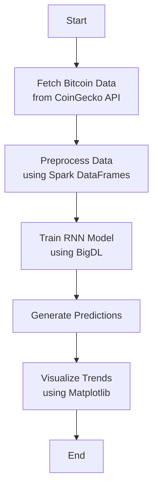

# 📈 Real-Time Bitcoin Price Prediction Pipeline

This project implements a real-time Bitcoin price forecasting system using **BigDL** and **Apache Spark**, integrated with the **CoinGecko API** for fetching live market data.

---

## 🚀 Key Features

- 🔄 **ETL Pipeline**: Fetch, clean, and transform data using Spark.
- 🧠 **RNN Model Training**: Leverages LSTM layers on historical data.
- 🔮 **Forecasting**: Predict future price trends using autoregressive techniques.
- 📊 **Visualization**: Compare actual vs. predicted prices using Matplotlib.
- 🐳 **Dockerized**: Environment packaged in Docker for easy reproducibility.

---

## 🧠 Technologies Used

| Tool          | Purpose                          |
|---------------|----------------------------------|
| **BigDL**     | Distributed deep learning        |
| **Spark**     | Scalable data processing         |
| **Matplotlib**| Visualization of results         |
| **CoinGecko** | Real-time Bitcoin data API       |
| **Docker**    | Containerized environment setup  |

---

## 🛠️ Project Structure

| File                | Description                                  |
|---------------------|----------------------------------------------|
| `Bitcoin_pipeline.py` | Main pipeline: ETL, training, prediction     |
| `bitcoin_api.py`      | Fetch, clean and transform Bitcoin data      |
| `Dockerfile`          | Docker image definition                     |
| `docker_build.sh`     | Builds the Docker image                     |
| `docker_bash.sh`      | Launches shell in container                 |
| `docker_jupyter.sh`   | Runs Jupyter Notebook inside container      |
| `requirements.txt`    | Python dependencies                         |

---

## 🧪 How It Works



---

## ⚙️ Installation

### 🐍 Local Python Setup

```bash
pip install -r requirements.txt
```

### 🐳 Docker Setup

```bash
bash docker_build.sh
bash docker_jupyter.sh  # Access at http://localhost:8888
```

---

## 📈 Sample Output

- 📉 Rolling average
- 📊 Price change %
- 📈 Predicted vs actual trendline

---

## 🔮 Future Enhancements

- Multi-currency prediction
- Alerts on volatility spikes
- Model tuning using GRU/Transformers

---
